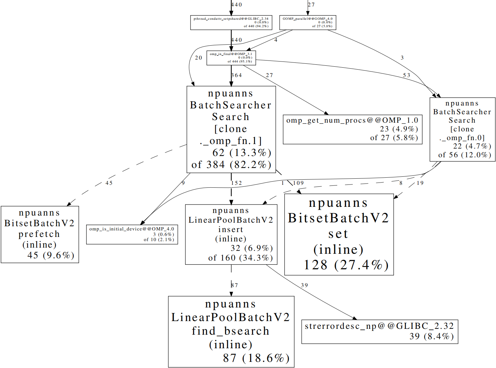

> **更新时间**：14/11/2024 19:37
## 性能分析
如何提升程序运行性能？仅仅通过查看代码，是很难发现性能瓶颈的，特别是在处理复杂的大型软件项目时。学会对程序进行性能分析，可以帮助开发者快速找到并解决程序中的问题，大大提升开发效率和应用性能。

## 性能分析工具之gperftools
gperftools 是由 Google 开发的一款性能分析工具，旨在帮助开发者分析和优化程序的性能，特别是在使用现代优化编译器（如 -O2）时。与传统的性能分析工具相比，gperftools 提供了更精细的控制，能够聚焦于程序的特定部分，从而帮助开发者更高效地定位性能瓶颈。


### 如何使用gperftools
#### 安装
```bash
git clone https://github.com/gperftools/gperftools.git
```
```bash
./autogen.sh 
./configure
make -j
```

安装时可能遇到一些依赖问题
1.  couldn‘t reopen directory ‘m4 xxxxx‘
```bash
sudo apt-get install libtool-bin #ubuntu
```
2. 后续补充

#### 使用
直接在代码里需要性能分析的地方插桩：
```cpp
#include <gperftools/profiler.h>
int main(int32_t argc, char *argv[])
{
    // Code
    ProfilerStart("profile_output.prof");
    searcher.Search(searchK, result);
    ProfilerStop();
    // Code
}
```
编译的时候也要链接gperftools：
```cmake
# Cmake lines
find_library(PROFILER_LIB profiler REQUIRED)
add_compile_options(-g)
target_link_libraries(your_program
    # Link options
    ${PROFILER_LIB}
)

```
运行程序方式不变~
#### 性能分析
1. 统计控制
```bash
export CPUPROFILE=profile_output.prof
export CPUPROFILE_FREQUENCY=999  #每秒采样999次
export CPUPROFILE_REALTIME=1
```
2.  文本分析
```bash
pprof --text ./program profile_output.prof
```
3. pdf绘图

需要安装graphviz：
```bash
sudo apt-get install graphviz #ubuntu
```
```bash
pprof --pdf ./program profile_output.prof > perf.pdf
```
4. 火焰图

需要下载FlameGraph：

```bash
git clone https://github.com/brendangregg/FlameGraph.git
```
```bash
#分析
pprof --collapsed ./ascendc_kernels_bbit profile_output.prof > perf.txt
#绘图
./FlameGraph/flamegraph.pl perf.txt > perf.svg
```
5. 分析过滤
   
- `--ignore="func1|func2"`：忽略部分函数的统计
- ` --nodefraction=0.02` ：占比小于百分之2的部分不统计

真实样例：
```bash
# 文字输出+忽略函数
pprof --text --ignore="npuanns::BatchSearcher::BatchSearcher|ComputeDis|ResetPool" ./ascendc_kernels_bbit profile_output.prof
# pdf输出+忽略函数+不统计
pprof --pdf --ignore="npuanns::BatchSearcher::BatchSearcher|ComputeDis|ResetPool" --nodefraction=0.02 ./ascendc_kernels_bbit profile_output.prof > perf.pdf
# 火焰图+忽略函数
pprof --collapsed --ignore="npuanns::BatchSearcher::BatchSearcher|ComputeDis|ResetPool" ./ascendc_kernels_bbit profile_output.prof > perf.txt
./FlameGraph/flamegraph.pl perf.txt > perf.svg
```


#### 常见问题
1. **未统计的代码段出现在报告中**：将未统计但是出现在报告中的函数使用`ignore`屏蔽掉
2. **不想关注探针代码段中的某些部分**：将这些部分封装成`inline`函数，然后`ignore`屏蔽掉
3. **函数名称分析错误**：暂时没有好的解决办法，观察pdf中的调用栈可以猜测出真实的函数名称
